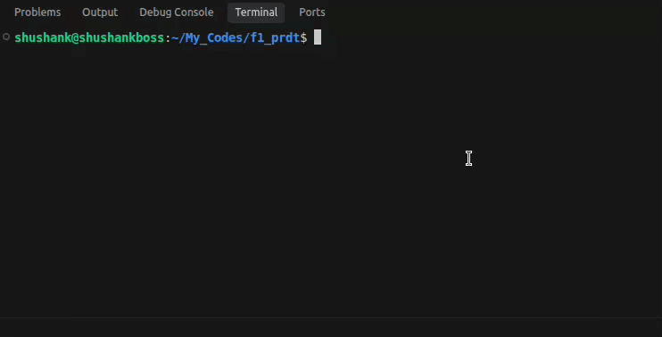
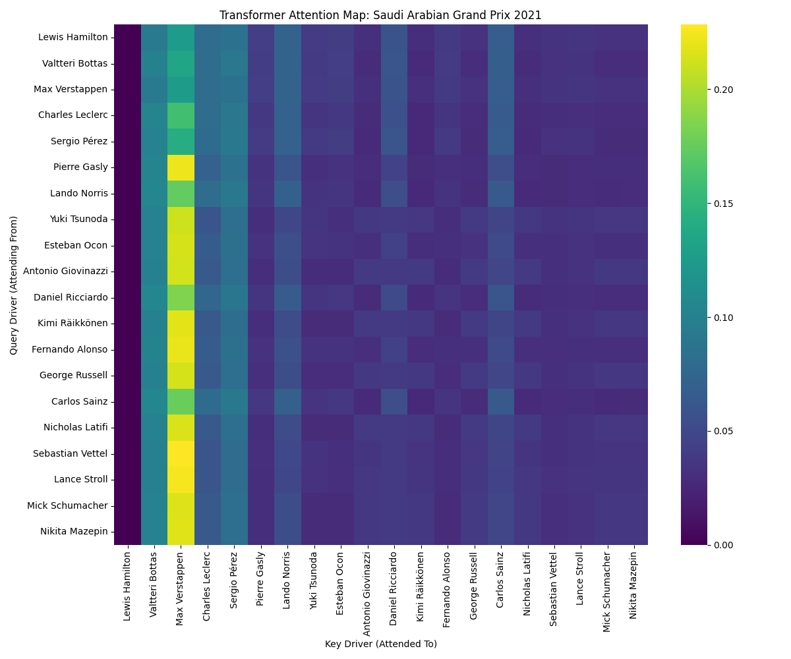

# F1 Race Winner Predictor

[](https://github.com/Sk16er/f1_prdt.git)



A machine learning system built with PyTorch to predict Formula 1 race winners. It leverages a custom Transformer architecture to model the complex dependencies between drivers on the grid.

## Architecture Highlights

Instead of treating drivers independently, this system models an F1 race as a sequence of drivers ordered by their starting grid. A **Transformer Encoder** utilizes Self-Attention to evaluate each driver's attributes (age, championship standings, constructor performance) relative to all other competitors. 

By analyzing the attention weights during inference, we can extract interpretable heatmaps that reveal exactly which competitors influenced the model's prediction the most.



## Quick Start

### Installation

```bash
git clone https://github.com/Sk16er/f1_prdt.git
cd f1_prdt
python -m venv .venv
source .venv/bin/activate  # On Windows: .\.venv\Scripts\activate
pip install -r requirements.txt
chmod +x f1
```
*Requirement: Ensure historical F1 CSV data is present in the `archive/` directory.*

### Usage

We provide a simple executable `f1` to interact with the system.

**1. Predict a Race (Interactive)**
```bash
./f1 predict
```
*Launches an interactive prompt to select the year and race. Outputs a terminal table with predicted winning probabilities and generates an attention heatmap.*

**2. Train the Model**
```bash
./f1 train --epochs 50 --batch-size 32
```
*Extracts features, trains the Transformer, and saves weights to `models/model.pt`.*

## Structure

- `src/data.py`: Pandas preprocessing and PyTorch DataLoaders.
- `src/model.py`: PyTorch Transformer implementation.
- `src/visualize.py`: Attention map generation.
- `src/cli.py`: Rich-based command-line interface.
- `f1`: Simple executable wrapper.

## Disclaimer

This model is intended solely for educational purposes and sports analytics research. F1 racing is highly unpredictable. Do not use this system for financial speculation or gambling.
